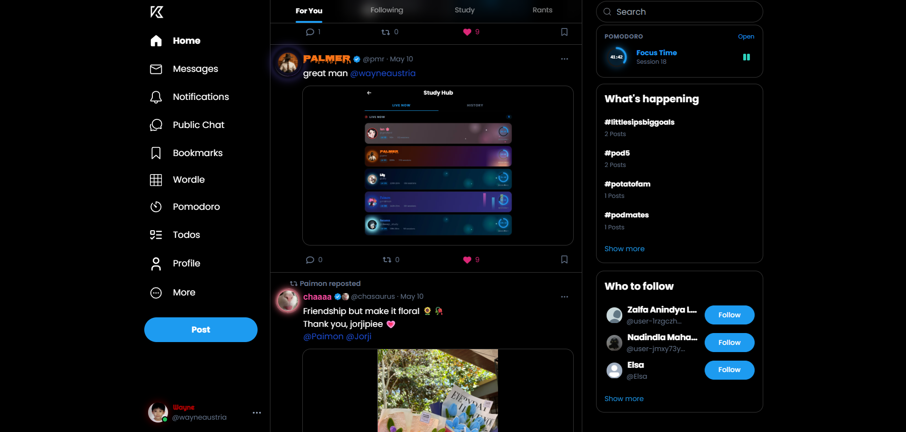
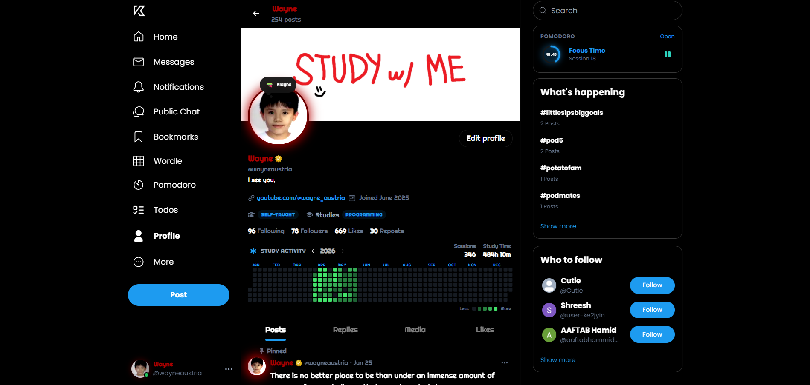
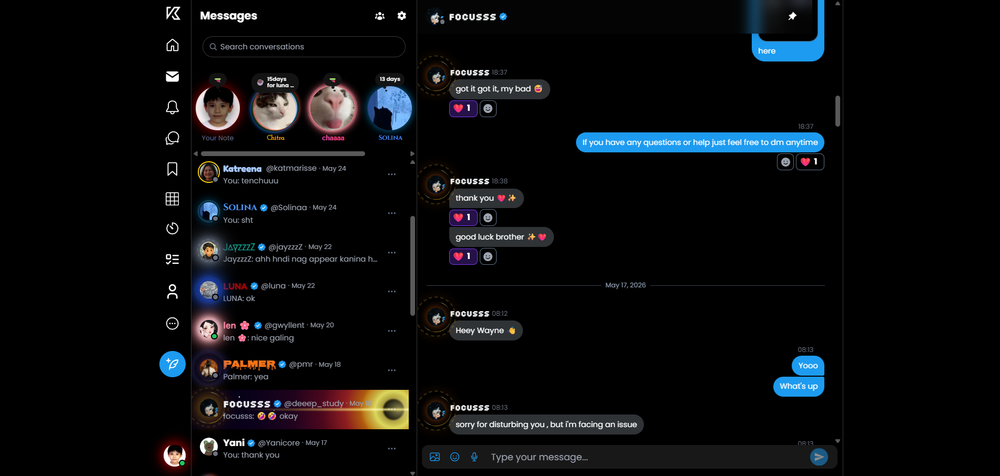
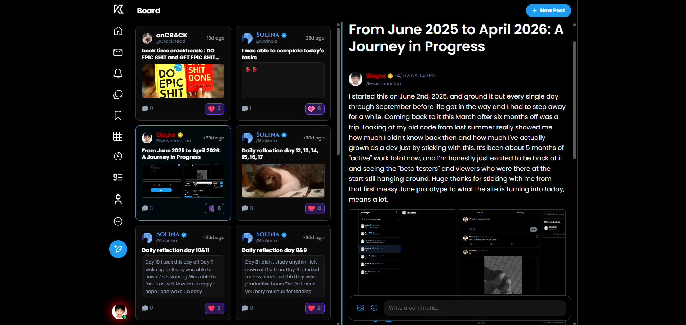
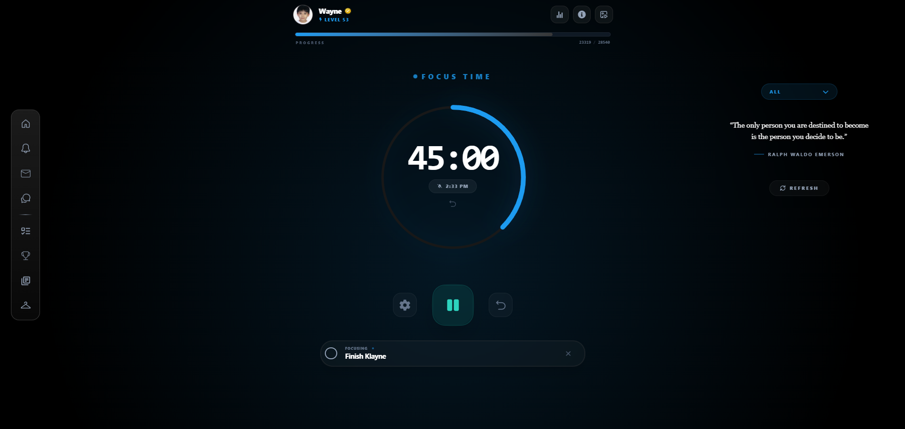
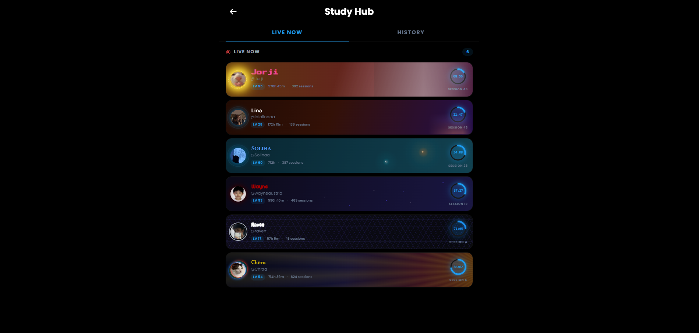
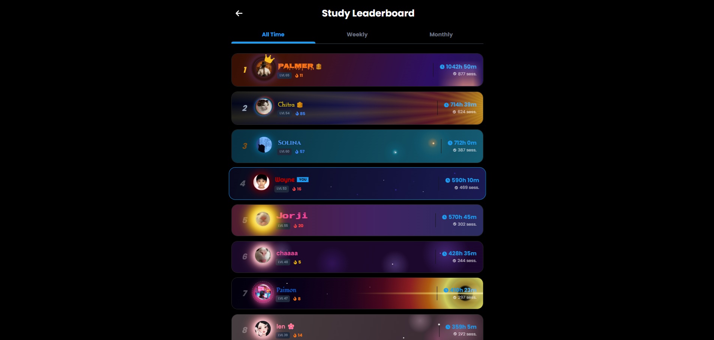
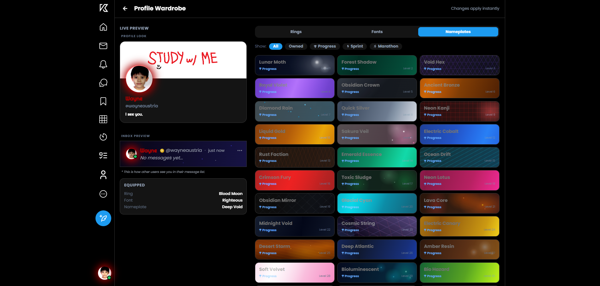

# Klayne

Klayne is a full-stack social productivity app built with React, Express, MongoDB, Socket.io, and Firebase Authentication. It combines a Twitter-like social feed with real-time chat, public community spaces, study tracking, Pomodoro sessions, todos, gamified profile customization, Wordle, devlogs, and admin moderation tools.

The app is organized as a single repository: the Express API serves the Vite frontend in production, while development uses Vite's `/api` proxy to the backend.

## Features

- Email/password authentication with JWT cookies, plus Google sign-in through Firebase Auth.
- Social posting with text, images, video, polls, replies, reposts, bookmarks, pinned posts, edit history, scheduled posts, hashtags, mentions, media tabs, and separate standard, study, and vent feeds.
- Real-time direct messages and group chats with typing indicators, read receipts, pinned messages, reactions, image and voice attachments, hidden conversations, muted conversations, group invite codes, join requests, roles, nicknames, and admin message deletion.
- Public chat with infinite history, image and voice messages, replies, edits, reactions, user deletion, admin deletion, bans, unbans, mute support, typing indicators, and unread counts.
- Notifications for follows, follow requests, request acceptance, likes, reposts, mentions, replies, board comments, and board replies, with Socket.io delivery and Web Push fallback.
- Profiles with followers, following, private accounts, follow requests, blocking, muting, profile and cover images, bio, link, education/field/status metadata, status preference, notes, preferred badges, and liked-feed privacy.
- Study and Pomodoro tools with persisted active sessions, pause/resume, heartbeat recovery, live session dashboard, task linking, study history, activity feed, weekly/monthly/total leaderboards, vacation mode, streaks, XP, levels, badges, and custom Pomodoro backgrounds.
- Todo lists with public/private lists, list likes, priorities, due dates, completion tracking, public completed todos, following lists, activity logs, and smart date recognition in the frontend.
- Board feature for long-form community posts with titles, content, tags, images, comments, replies, reactions, pinned posts, unread board counts, and board notifications.
- Devlog system with admin-only create/update/delete, pinned devlogs, tags, likes, comments, comment likes/dislikes, and paginated detail pages.
- Wardrobe system for equipping unlocked themes, fonts, profile rings, and nameplates earned through study progress.
- Daily Wordle with generated daily puzzles, validated guesses, attempt history, stats, daily and all-time leaderboards, and unlockable Wordle badges.
- Suggestion box for feature, bug, idea, and other feedback, including optional screenshots and an admin review dashboard.
- PWA support through `vite-plugin-pwa`, service worker notifications, install prompt handling, and Web Push subscriptions.
- Link preview endpoint for safe URL metadata previews.

## Screenshots

| Home Feed | Profile |
| --- | --- |
|  |  |

| Messages | Community Board |
| --- | --- |
|  |  |

| Pomodoro | Live Sessions |
| --- | --- |
|  |  |

| Study Leaderboard | Wardrobe |
| --- | --- |
|  |  |

## Tech Stack

| Area | Technology |
| --- | --- |
| Frontend | React 19, Vite 6, React Router 7, TanStack Query 5, Zustand 5 |
| Styling | Tailwind CSS 3, DaisyUI, React Icons, custom CSS for rings/nameplates |
| Backend | Node.js, Express 5, Mongoose 8, Socket.io 4 |
| Database | MongoDB Atlas or any MongoDB-compatible connection |
| Auth | JWT HTTP-only cookies, bcryptjs, Firebase Admin, Firebase client SDK |
| Media | Cloudinary uploads and deletion |
| Realtime | Socket.io over websocket/polling |
| Background jobs | node-cron and a one-minute scheduled-post publisher interval |
| PWA/Push | vite-plugin-pwa, service worker, Web Push VAPID keys |

## Repository Structure

```text
backend/
  config/       Firebase Admin initialization
  controllers/  Express business logic for auth, posts, chat, study, todos, board, devlog, etc.
  cron/         scheduled post publishing, weekly/monthly study resets, daily Wordle setup
  data/         Wordle CSV word lists
  db/           MongoDB connection
  lib/          Socket.io server and shared backend utilities
  middleware/   route protection and admin guard
  models/       Mongoose schemas
  routes/       API route definitions
frontend/
  src/api/        fetch clients for backend APIs
  src/components/ shared UI, skeletons, and SVG components
  src/constants/  app constants, themes, quotes, Wordle words, Pomodoro presets
  src/context/    Socket and theme providers
  src/features/   feature modules for auth, posts, chat, todos, Pomodoro, board, etc.
  src/hooks/      custom, image, and global socket hooks
  src/pages/      routed pages
  src/services/   Firebase client setup
  src/store/      Zustand stores
  src/styles/     global CSS
  src/utils/      formatting, push, Cloudinary, date, badge, and text helpers
```

## Data Models

Klayne uses these Mongoose models:

| Model | Purpose and key relationships |
| --- | --- |
| `User` | Account, profile, social graph, blocks/mutes, badges, wardrobe inventory/equipped items, Pomodoro settings/stats, notes, and Cloudinary image references. |
| `Post` | Feed posts, replies via `parentPost`, reposts via `repostedFrom`, polls, scheduled posts, bookmarks, mentions, hashtags, anonymous vent posts, and media. |
| `Image` | Cloudinary-backed media referenced by posts, messages, users, and conversations. |
| `Conversation` | DM and group metadata, participants/members, roles, invite codes, join requests, pinned messages, last message state, and group avatar. |
| `Message` | Private/group messages with images, voice messages, replies, reactions, edits, seen state, deletion state, and `conversationId`. |
| `PublicChatMessage` | Public room messages with media, replies, reactions, edits, and deletion/moderation flags. |
| `Notification` | Follow, post, reply, mention, and board notification records. |
| `BoardPost` / `BoardComment` | Community board posts, images, tags, comments, flat replies, reactions, and moderation deletion flags. |
| `TodoList` / `Todo` / `TodoActivity` | Todo sections, todos, completion snapshots, public visibility, likes, priorities, due dates, and activity logs. |
| `StudySession` / `ActiveSession` | Completed study records and currently running Pomodoro sessions. `ActiveSession` has a TTL index for stale cleanup. |
| `WeeklyWinners` / `MonthlyWinners` | Archived top-three study leaderboard winners. |
| `WordlePuzzle` / `WordleAttempt` | Daily Wordle answers and per-user guesses, scores, status, and history. |
| `Hashtag` | Trending tag counters and last-used timestamps. |
| `Devlog` / `DevlogComment` | Product update posts and interactions. |
| `Suggestion` | User-submitted feedback with optional Cloudinary screenshot. |
| `PushSubscription` | Web Push endpoints and device metadata. |
| `LevelUp` | Level-up event records. |

## API Overview

All main API routes are mounted under `/api`.

| Base path | Capabilities |
| --- | --- |
| `/api/auth` | `GET /me`, `POST /signup`, `POST /login`, `POST /logout`, `POST /google` |
| `/api/users` | profiles, suggested users, search, follow requests, follow/unfollow, block, mute, privacy, notes, stats, account deletion, Pomodoro background |
| `/api/posts` | create, edit, delete, feeds, replies, thread, likes, reposts, bookmarks, polls, pinned posts, scheduled posts, vent posts, study posts, read markers |
| `/api/messages` | conversations, message send/edit/delete/react, pinned messages, conversation search, visibility, mute, delete on my side |
| `/api/groups` | group create/update/delete, members, roles, nicknames, invites, join requests, ownership transfer, admin message deletion |
| `/api/public-chat` | public messages, send/edit/delete/react, mute, admin delete, ban, unban |
| `/api/notifications` | list and delete notifications |
| `/api/study` | Pomodoro settings, active sessions, pause/end/cancel/heartbeat, live sessions, server time, activity, history, badges |
| `/api/leaderboard` | total, weekly, monthly, and previous winner leaderboards |
| `/api/todos` | todos, completed/public/following filters, counts, completion goals, activity log |
| `/api/todolists` | user/public/following lists, list CRUD, list likes, todos in list |
| `/api/board` | board posts, comments, reactions, edits, deletes, mark-as-read |
| `/api/devlogs` | devlog feed/detail, admin CRUD, likes, comments, comment likes/dislikes |
| `/api/wardrobe` | inventory and equip item |
| `/api/hashtags` | trending tags and hashtag feeds |
| `/api/suggestions` | submit suggestion and admin review actions |
| `/api/wordle` | today's puzzle, guess submission, stats, daily/all-time leaderboards, history |
| `/api/images` | fetch image by id |
| `/api/push` | subscribe, send test/target notification, subscription status |
| `/api/link-preview` | fetch Open Graph/link preview metadata |

## Realtime Events

Socket.io is initialized in `backend/lib/socket.js`. The backend accepts `userId` in the socket query and tracks online users, public chat presence, active chat rooms, typing state, live Pomodoro rooms, and unread counters.

Important events include:

- Client to server: `heartbeat`, `changeOnlineStatus`, `joinConversation`, `leaveConversation`, `typing`, `stopTyping`, `userActiveInChat`, `markMessagesAsSeen`, `userEnteredPublicChat`, `userLeftPublicChat`, `public_typing`, `public_stop_typing`, `markNotificationsAsRead`, `join_pomodoro_room`, `leave_pomodoro_room`.
- Server to client: `getOnlineUsers`, `unreadMessageStatus`, `unreadNotificationStatus`, `unreadPublicChatStatus`, `followRequestCount`, `newNotification`, `newPostCount`, `newICPostCount`, `newVentPostCount`, `newICUnreadDot`, `newVentUnreadDot`, `newBoardPostCount`, `newMessage`, `messageDeleted`, `messageEdited`, `messageReacted`, `messagesSeen`, `groupMessagesSeen`, `conversationUpdated`, `pinnedMessage`, `publicMessageDeleted`, `publicOwnMessageDeleted`, `publicMessageEdited`, `publicMessageReactionUpdated`, `public_typing_update`, `bannedFromPublicChat`, `userBanned`, `userUnbanned`, `addedToGroup`, `removedFromGroup`, `groupDeleted`, `groupUpdated`, `messageDeletedByAdmin`, `joinRequestRejected`, `live_session_started`, `live_session_stopped`, `pomodoroSessionStarted`, `pomodoroSessionPaused`, `pomodoroSessionCompleted`, `pomodoroBreakEnded`, `pomodoroTaskUpdated`, `inbox_note_updated`, `inbox_note_deleted`.

## External Services

- MongoDB stores all application data through Mongoose.
- Cloudinary stores post images/videos, chat images/voice messages, user profile/cover images, group avatars, board images, suggestion screenshots, and Pomodoro custom backgrounds.
- Firebase client Auth handles Google sign-in; Firebase Admin verifies Google ID tokens on the backend and is used during account deletion cleanup.
- Web Push sends offline notifications using VAPID keys and saved browser subscriptions.
- Google Fonts are loaded dynamically for wardrobe font items.
- Render is assumed by the code through `RENDER_EXTERNAL_URL`, production static serving, and Socket.io CORS configuration.

## Getting Started

### Prerequisites

- Node.js 20 or newer recommended
- npm
- MongoDB connection string
- Cloudinary account
- Firebase project with Google Authentication enabled
- VAPID key pair for Web Push

### Install

```bash
npm install
npm install --prefix frontend
```

### Environment

Copy `.env.example` to `.env` at the repository root and fill in the values. The backend loads environment variables from the root through `dotenv`. Vite reads frontend variables prefixed with `VITE_`.

```bash
cp .env.example .env
```

On Windows PowerShell:

```powershell
Copy-Item .env.example .env
```

### Development

Run the backend:

```bash
npm run dev
```

Run the frontend in another terminal:

```bash
npm run dev --prefix frontend
```

The frontend runs at `http://localhost:3000` and proxies `/api` to `http://localhost:5000`.

### Production Build

```bash
npm run build
npm start
```

In production, Express serves `frontend/dist` and falls back to `index.html` for client routes.

## Scripts

| Command | Description |
| --- | --- |
| `npm run dev` | Start the Express backend with nodemon and `NODE_ENV=development`. |
| `npm start` | Start the Express backend in production mode. |
| `npm run build` | Install root and frontend dependencies, then build the Vite frontend. |
| `npm run dev --prefix frontend` | Start the Vite dev server on port 3000. |
| `npm run build --prefix frontend` | Build the frontend. |
| `npm run lint --prefix frontend` | Run ESLint for the frontend. |
| `npm run preview --prefix frontend` | Preview the frontend production build. |

## Deployment Notes

The codebase is Render-friendly:

- Build command: `npm run build`
- Start command: `npm start`
- Root directory: repository root
- Required production environment variables: see `.env.example`
- Set `NODE_ENV=production`
- Set `RENDER_EXTERNAL_URL` to the public backend URL, for example `https://your-app.onrender.com`
- Add the same production URL to Firebase/Google OAuth origins and redirect settings

## Security Notes

- JWTs are stored in HTTP-only cookies and marked secure outside development.
- Signup and login routes use `express-rate-limit`.
- Protected routes use `protectRoute`; admin-only routes use `isAdmin`.
- The repo should never contain real `.env` values, Firebase service account JSON, Cloudinary secrets, VAPID private keys, or MongoDB credentials.

## License

This project is licensed under the [ISC License](LICENSE).

## Contributing
Contributions are welcome! Please read [CONTRIBUTING.md](CONTRIBUTING.md) for details on our code of conduct and the process for submitting pull requests.
